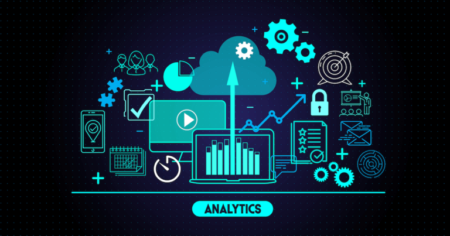
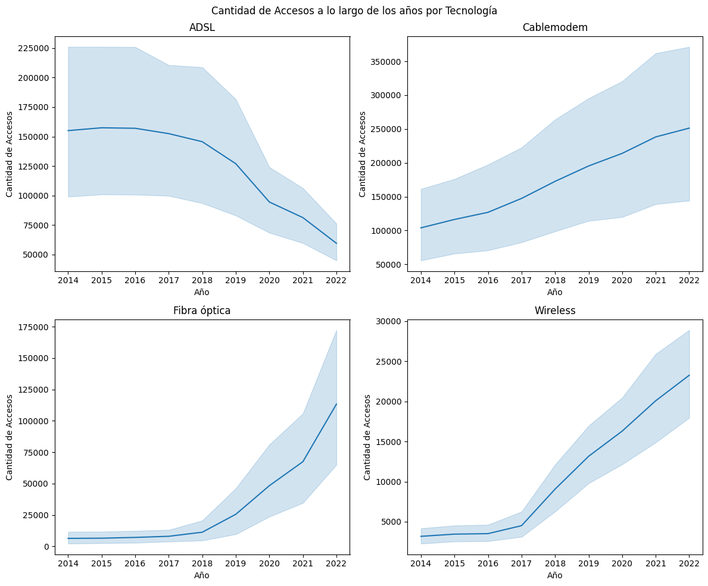
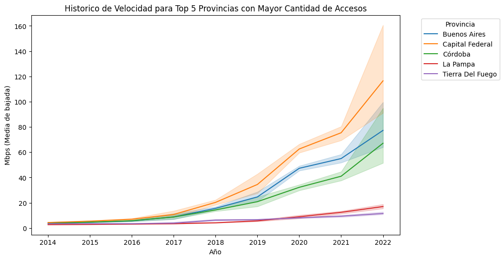
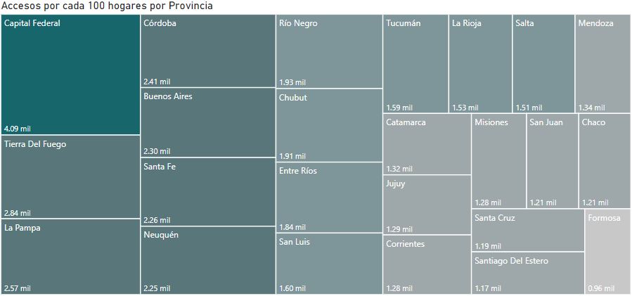

<h1 align='center'>
 <b>PROYECTO ANÁLISIS DE DATOS</b>
</h1>

¡Bienvenidos a mi proyecto!, tomando el rol de ***Data Analyst*** sobre las telecomunicaciones en Argentina. 
En este README, se explicará de forma general el proyecto desde el EDA, hasta algunas conclusiones sobre
los datos y KPI´s así como el uso de Power BI para el dashboard final.
 
# <h1 align="center">**`Análisis de Telecomunicaciones en Argentina`**</h1>

### **Descripción y Contexto del Proyecto**

Las telecomunicaciones se refieren a la transmisión de información a través de medios electrónicos, como la telefonía, la televisión, la radio y, más recientemente, el internet. Estos medios de comunicación permiten la transmisión de información entre personas, organizaciones y dispositivos a largas distancias.

El internet, por su parte, es una red global de computadoras interconectadas que permite el intercambio de información en tiempo real. Desde su creación, ha tenido un impacto significativo en la vida de las personas, transformando la manera en que nos comunicamos, trabajamos, aprendemos y nos entretenemos.

La industria de las telecomunicaciones ha jugado un papel vital en nuestra sociedad, facilitando la información a escala internacional y permitiendo la comunicación continua incluso en medio de una pandemia mundial. La transferencia de datos y comunicación se realiza en su mayoría a través de internet, líneas telefónicas fijas, telefonía móvil, y en casi cualquier lugar del mundo. 

En comparación con la media mundial, Argentina está a la vanguardia en el desarrollo de las telecomunicaciones, teniendo para el 2020 un total de [62,12 millones de conexiones](https://www.datosmundial.com/america/argentina/telecomunicacion.php). 

Como tal, el enfoque de este proyecto será relacionado específicamente con Internet y Telefonía, a lo largo de este readme se demostrará porque se escogieron esos dos servicios para este proyecto.

### **Roles principales del Proyecto**

Este proyecto se divide de forma estructurada en los siguientes puntos, que se describen a continuación en este readme:

- EDA (Análisis Exploratorio de Datos):
    - Calidad del dato.
    - Análisis de relaciones y patrones de los datos.

- Enfoque del Storytelling del proyecto:
  Conociendo los datos en el EDA se pudo definir un enfoque sobre el cual se presentarán los dashboards.

- KPI´s (Indicador Clave de Rendimiento):
  Conociendo los datos en el EDA se pudo definir ciertos KPI´s que serán abordados en este readme y que fueron incluidos en los dashboards de Power BI.

- Dashboard con Power BI:
  Finalmente, para presentar las visualizaciones y los KPI´s del proyecto, se realizaron gráficos interactivos utilizando Microsoft Power BI.

`EDA (Análisis Exploratorio de Datos)`

- Calidad del dato: 
Se inició el EDA con una fase de preprocesamiento para limpiar el conjunto de datos. Esta etapa implicó la identificación y manejo de valores faltantes o nulos, outliers, la corrección de formatos de datos y la unificación de tablas relevantes para un análisis más profundo. El método utilizado para calcular los outliers fue el del umbral de 3 desviaciones estándar y se consideraron outliers los superiores e inferiores al umbral definido. Para tener mayor prolijidad en el código y mayor orden a lo largo del proyecto, se desarrolló un archivo helper.py que cuenta con funciones para hacer análisis sobre la calidad del dato.  
- Análisis de relaciones y patrones de los datos: 
Se exploraron diferentes variables presentes en el conjunto de datos, como la cantidad de accesos por tecnología, la distribución de servicios por provincia, la evolución de ingresos a lo largo de los años y otros factores relevantes dentro de la industria de las telecomunicaciones. 
Por ejemplo, en el siguiente gráfico se puede observar el cambio que hay entre la cantidad de accesos por año por cada tipo de tecnología: ***Nota:*** Los gráficos presentados en este README son para tener un primer vistazo, se pueden observar con mayor profundidad en el jupyter notebook de este repositorio 

En un breve vistazo podemos ver que para ADSL fue reduciendo la cantidad de accesos promedio por año y que para fibra óptica comenzó a haber un incremento notable a partir de 2018 en adelante.  

Por otra parte, con el EDA se pudo saber cuál es el Top 5 de provincias con mayor cantidad de accesos y con base en ese Top 5 se realizó la siguiente gráfica que presenta la evolución de las velocidades que tiene cada provincia en promedio a lo largo de los últimos años, basado en las provincias del Top 5: 

 
Un breve análisis con lo que podemos observar es que, hay mucha variación en la velocidad aún habiendo seleccionado el Top 5 con mayor cantidad de accesos por ejemplo, para Tierra de fuego que está en el top 2 de cantidad de accesos, tiene las menores velocidades a lo largo de la gráfica de tiempo. Lo cual, denota que no hay una relación entre la cantidad de accesos y la velocidad promedio por provincia, pero en algunos casos si es congruente como es el caso de Cápital Federal. Para analizar mejor las gráficas se puede ingresar al notebook de este repositorio.

`Enfoque del Storytelling del proyecto`

Con base en el EDA y toda la información que se analizó, se decidió tomar el siguiente enfoque para la narrativa que se va a seguir durante los dashboards y el resto del proyecto: Principalmente, el enfoque se basa en que, los servicios con mayor cantidad de reclamos son los servicios de Internet y Telefonía (como parte de la consigna de este proyecto se dió como fuente de datos obligatoria el Servicio de Internet) por lo cual, se tomó en cuenta la telefonía como un análisis complementario. Tomando en cuenta la cantidad de reclamos y considerando que Internet cuenta con una mayor cantidad de ingresos por este servicio, se decidió presentar KPIs relacionados con estos dos servicios y tomar el enfoque de la mejora de los mismos. Se presentarán KPIs que serán enfocados acorde con esta narrativa.

`KPI´s (Indicador Clave de Rendimiento)`

KPI de aumento en un 2% los accesos:  
Aumentar en un 2% el acceso al servicio de internet para el próximo trimestre, cada 100 hogares, por provincia.  
La fórmula es la siguiente: 

 $`KPI = ((Nuevo acceso - Acceso actual) / Acceso actual) * 100`$
 
Donde:

- "Nuevo acceso" se refiere al número de hogares con acceso a Internet después del trimestre anterior.
- "Acceso actual" se refiere al número de hogares con acceso a Internet en el trimestre de referenica.
Es decir:  
Esta fórmula ayudará a calcular el KPI para medir el aumento en el acceso a Internet por cada 100 hogares en cada provincia para cualquier trimestre, ya sea para trimestres actuales siempre y cuando sean triemstres consecutivos.

**Ejemplo de uso:**

KPI = ((510 - 500) / 500) * 100 = 2%

Esto indicaría un aumento del 2% en el acceso a Internet en esa provincia para el próximo trimestre.

KPI de reducción de reclamos por tipo de reclamo:  
Este KPI cuenta con un filtro al cual según le indiques en el filtro que tipo de reclamo quieres analizar, por ejemplo problemas técnicos o problemas con la facturación, entonces te muestra un KPI de si para ese mes se pasó el KPI o si no se logró cumplir, tambien cuenta con un filtro del 2, 5 y 10% para que con base en eso muestre si esta mes en comparación con el mes anterior tuvo la reducción de ese porcentaje en los reclamos. 

KPI de aumento de los ingresos(2, 5 y 10%):  
Este KPI también cuenta con un filtro de porcentaje pero de incremento y hace la comparación de ingresos por trimestre, es decir se toma en cuenta dos trimestres y te da como resultado si conseguiste superar el aumento en un 2, 5 y 10% según lo seleccionado en el filtro. Por otro lado, este KPI puede funcionar tanto para Internet como para Telefonía ya que la estructura de ambos conjuntos de datos es muy similar.

`Dashboard con Power BI`

Para este dashboard se aplicó el patrón Z para tener una mejor visualización, más clara de los datos. El patrón Z en diseño se refiere a un concepto de diseño que se basa en el seguimiento de la trayectoria natural de la lectura que los ojos humanos tienden a seguir al mirar una página. Esto resulta en una distribución más efectiva de la información, facilitando la comprensión y la interacción con los datos presentados.  
A continuación se presenta uno de los gráficos realizados en Power BI pero el dashboard completo con sus distintas pestañas y los KPIs se encuentran en el archivo del dashboard.  

### **Conclusiones del Proyecto**

El análisis de datos realizado en el contexto de la industria de las telecomunicaciones presentó una amplia gama de información valiosa sobre varios aspectos del servicio. Se exploraron múltiples variables, desde el rendimiento de accesos a Internet hasta la evolución de los ingresos a lo largo de los años. La visualización de datos fue una herramienta clave para comprender y presentar estos hallazgos. Por ejemplo, se identificaron cambios notables en los patrones de accesos a Internet, con un crecimiento exponencial en la conectividad móvil y un aumento significativo en la cobertura de fibra óptica.  
El análisis permitió revelar tendencias de comportamiento y patrones de crecimiento, lo que resulta crucial para la toma de decisiones estratégicas y la mejora continua de los servicios de telecomunicaciones.  
En resumen, este análisis demostró que el EDA y las técnicas de visualización de datos son herramientas esenciales para descubrir, analizar y comunicar tendencias y patrones significativos en la industria de las telecomunicaciones.

## Fuente de datos
**Obligatorio(Consigna del proyecto):**

- [Datasets principales](https://datosabiertos.enacom.gob.ar/dashboards/20000/acceso-a-internet/) sobre Internet.

**Complementario:**
- [Datasets complementarios](https://datosabiertos.enacom.gob.ar/home) de reclamos y Telefonía.